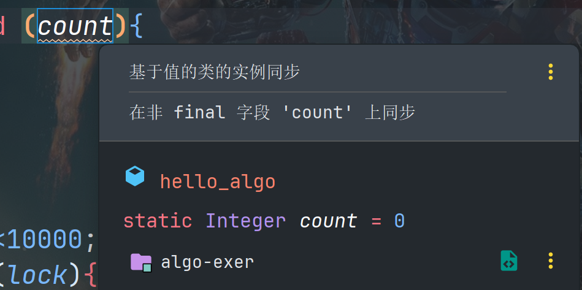

## 一道有趣的题目

在b站看到一道Java并发的题目：

> 源视频出处：【有人说这个题太坑了，一起来review！】https://www.bilibili.com/video/BV1yDgwzpEFc?vd_source=27fdfdebc4dbb1b3cad17619a9b33aaf

```java
static Integer count = 0;
public static void main(String[] args) throws InterruptedException {
  Thread thread = new Thread(() -> {
    for (int i = 0; i < 10000; i++){
      //count++;
      synchronized (count){
        count++;
      }
    }
  });
  thread.start();
  for (int i=0; i<10000; i++){
    synchronized (count){
      count++;
    }
  }
  thread.join();
  System.out.println(count);
}
```

这里无论对count是否加`synchronized`修饰，最终输出都不会是20000且每次结果不同，也就是说加锁并没有产生实质上的结果。

并发操作的原子性问题


Integer类实际是被final修饰的

count++在Java中并不是一个原子性操作，每一个递增的操作都会生成一个新的对象，Java中加锁是加在对象上而非引用上的，因此锁住的对象不是同一个，加锁没有意义，需要加个其他的锁


**`thread.join()` 作用**


本质上是因为Integer是不可变的（即final修饰的类），因此synchronized锁指向的Monitor是不同的，需要把锁对象设置为final确保是同一个锁，IDEA中也是如此提示的：




```java
static Integer count = 0;
  static Object lock = new Object();
  public static void main(String[] args) throws InterruptedException {
    Thread thread = new Thread(() -> {
      for (int i = 0; i<10000; i++){
        //count++;
        synchronized (lock){
          count++;
        }
      }
    });
    thread.start();
    for (int i=0; i<10000; i++){
      synchronized (lock){
        count++;
      }
    }
    thread.join();
    System.out.println(count);
  }
```


