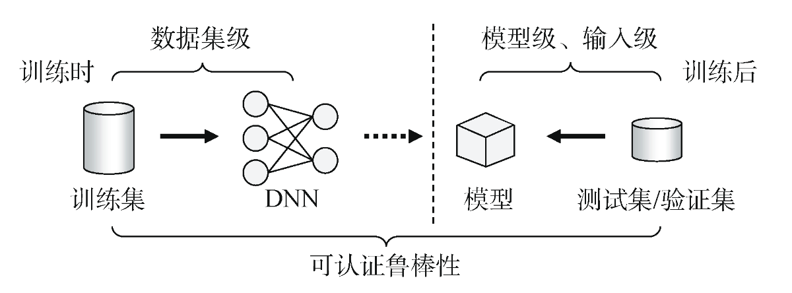

## 深度神经网络后门防御综述

[深度神经网络后门防御综述-A Survey on Defense against Deep Neural Network Backdoor Attack](https://jcs.iie.ac.cn/xxaqxb/ch/reader/view_abstract.aspx?file_no=20240403&st=alljournals)

这篇综述讲了神经网络后门攻击和防御的经典手段，虽然是2024年出版的，但是貌似写作时间在22年左右，聚焦在计算机视觉领域。

本文主题是围绕神经后门攻击（Backdoor Attack）或神经网络木马攻击（Trojan Attack）。后门与特定类型触发器相关，带有触发器的样本会导致样本分类为攻击者预先设定的类别。

> 危险之处就在于，如果像在自动驾驶领域，模型识别红灯为绿灯这样，危险性极高。

**攻击的发起条件**：如开源模型或者数据集，可能会直接引入恶意攻击者的植入

后门防御方法分类：

