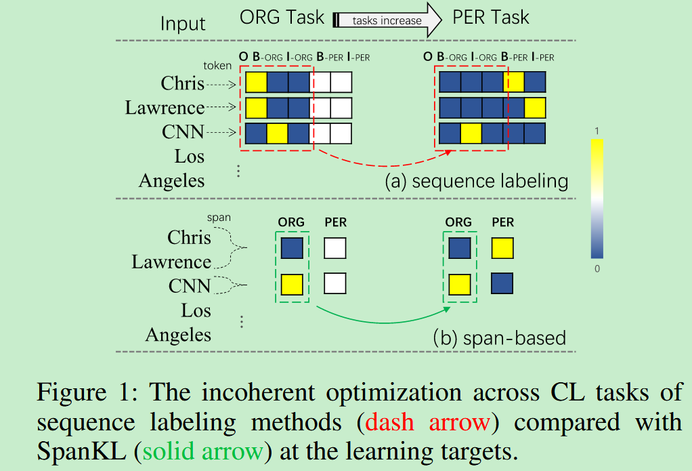
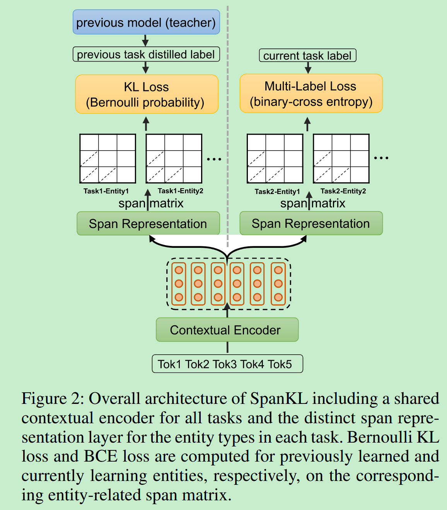
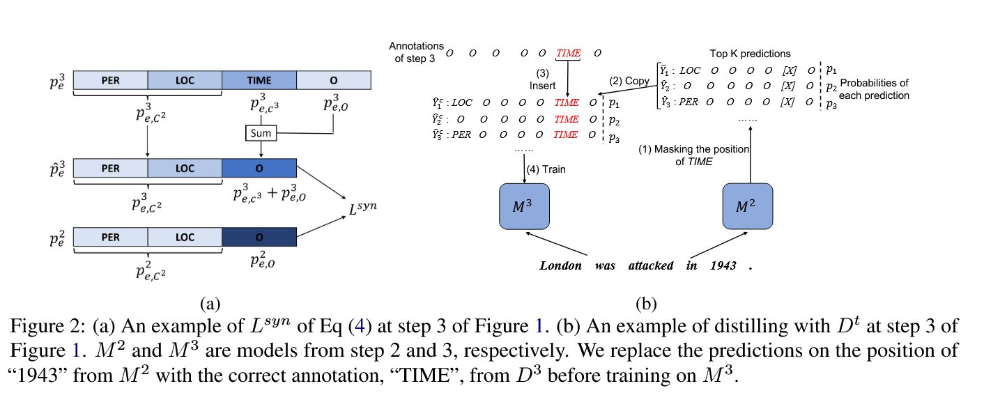
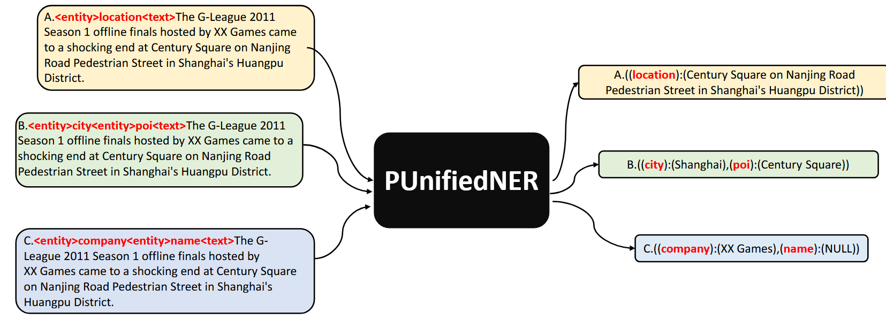

## Few-Shot Named Entity Recognition: A Comprehensive Study

文章地址在：http://arxiv.org/abs/2012.14978

文章中没有给出github代码库链接，搜了搜才找到：[few-shot-NER-benchmark/BaselineCode: The 3 baseline methods for few-shot NER tasks](https://github.com/few-shot-NER-benchmark/BaselineCode)

这是一篇few-shot NER的综述。PLMs即 Pretrained Language models。

文中提到

SOTA NER models are often initialized with PLM weights, fine-tuned with standard supervised learning. One classical approach is to add a linear classifier on top of representations provided by PLMs, and fine-tune the entire model with a cross-entropy objective on domain labels. 这也是为本文提供baseline的方法

遇到的问题是，尽管有很多的方法，但是NER构建还是一种labor-intensive 和 time-consuming的任务，需要大量的专家标注，但是现实世界的新领域的数据是很有限的。

本文中提出的方法是：

1. create prototypes as the representations for different entity types, and assign labels via the nearest neighbor criterion
2. Continuously pre-train PLMs using web data with noisy labels that is available in much larger quantities to improve NER accuracy and robustness
3. employ unlabeled in-domain tokens to predict their soft labels using self-training, and perform semi-supervised learning in conjunction with the limited labeled data

这三个方法简单来说就是：Prototype-based methods, noisy supervised pre-training and self-training.

他们的贡献在于对少样本NER的系统研究，提出了三种方式，在十个公开的不同领域数据集上做了对比，达到SOTA。

这几种方法的backbone都是RoBERTa model，且本文在实验方面采用了若干种不同的组合方式：

Conclusion：supervised pre-training and self-training turn out to be particularly effective

**关于代码部分**：

这里有个小坑，3.8的python环境是可以的，但是3.9会出问题。

---

## Continual Learning for Named Entity Recognition

这篇提出的是AddNER&ExtendNER模型。

在现实世界中，命名实体的类型（entity types）会经常新增，这就需要重新训练模型，但是如果重新标注原始数据或者数据集在经济性和安全性上都可能不太实际，这就引出了本文的主题**Continual Learning for NER**，也就是连续学习或者增量学习。

**灾难性遗忘（catastrophic forgetting）**对增量NER来说是很严重的问题，本文用的是知识蒸馏的方法。

出现新的实体类别就需要更新模型，因此需要新的数据，全量标注基本行不通，更常见的做法是：Annotate a new dataset only for new entity types。不过本文用的是self-training的方法，用旧模型标注新数据集，来教导学生模型学习。

基于的backbone是`BERT-based` models，datasets是`CoNLL-03`和`OntoNotes`，tags格式是IBO format，训练是在单卡V100上做的。

模型参数设置：batch size=32 lr=5e-5; 20 epochs with early stopping(patience=3), 学生模型 $$T_m=2$$，weighted sum of the losses $$\alpha = \beta = 1$$.

本文中教师和学生模型的组成：

* **encoder layers**, which produce an h-dimensional contextual representation for each token of a sentence
* **tagger layers**, which output probability distributions for each token with respect to the target labels

**AddNER Model**

绿色层是新加的层，用来学习新的实体类型。需要注意的是，这里的绿色层在迭代过程中实际加了许多的输出层用来识别不同的实体类别：

1. if the model is iteratively extended, a new output layer is added at each iteration;
2. if m is the number of new entity types added in a given iteration, then the matrix of the corresponding output layer will have a dimensionality of h × (2m + 1)
3. 这里的2m+1因为每个类都有B-和I-，以及有一个O

这里在计算KD loss时，$$\alpha =1$$也就是全部依赖于学习模仿教师模型输出的soft labels。

AddNER由KD loss和CE loss联合训练，$$L^{Add}=\alpha L_{KL}^{Add}+\beta L_{CE}^{Add}$$。

模型的一个问题是对单个token的不同layer的输出需要做合并，毕竟有可能不同层对同一个token输出的结果是截然不同的，作者设置了一套规则和启发式算法来帮助完成这件事（下面几条是列举原文的）：

* If all layers predict the O tag, then output=O
* If exactly one layer predicts a B- tag and the other layers predict O, then output=B-.
* If multiple layers predict B- tags and the remaining layers predict O, then output=B- with the highest probability.
* If a layer predicts an I- tag, output=I- only if it matches the preceding tag in the sequence, i.e., the tag of the previous token must be a B- or I- of the same entity type. Otherwise, the output of that layer is treated as O, and the heuristics are applied again to determine the final output.

**ExtendNER Model**

ExtendNER中教师和学生模型也是一致的，在识别新类的策略上，直接对Linear layer也就是tagger output layer直接进行维度的拓展；每新增一个类dimension增加2。损失函数的计算和上一个模型是一样的。

最终tags获取需动态调整输出维度；通过维特比算法（Viterbi）解码全局最优路径。

## A Neural Span-Based Continual Named Entity Recognition Model

文章地址：http://arxiv.org/abs/2302.12200

本文提出模型**SpanKL**，一个Span-based model with Knowledge distillation (KD)

Introduction部分提出在传统的增量NER序列标注任务中，对于O标签的token可能会在新任务到来后改变，这种行为的影响在原文中表示为：

> This incoherent optimization will force the model to frequently update the previously learned parameters, thus we consider aggravates the catastrophic forgetting or interference.

一种更有效的方式是，在当前任务中的O标注为`O-ORG`的形式，这样是把一个entity'识别问题转换为了一个二分类问题。

作者提出了**SpanKL**模型。这是一种Span-based Model。是一种用于处理文本中连续片段（Span）的模型，其核心思想是直接建模文本中的片段（Span），而不是逐个处理单词或字符，这种方法可以更好捕捉片段级别的语义信息，并在某些任务中表现更优。

为coherently optimizing提供了一些优势：

* 在采用KD的CL中是向后兼容的
* 向前兼容，通过二分类识别减少对未来任务的干扰
* span和entity-level的独立建模有更好的学习和蒸馏能力
* 得益于 span-based method ，CL-NER中支持任何嵌套实体，嵌套实体是指一个实体完全包含在另一个实体内部的情况。

这篇文献中使用的数据集是OntoNotes和Few-NERD

**SpanKL** NER Model

不同任务中的方法是non-overlapping

模型结构如图是由Contextual Encoder，Span Representation layer， multi-label loss layer with KD.

* Contextual Encoder：输入的tokens经过embedding vector后传入contextual encoder来得到contextual hidden vectors

这里的Span Matrix主要是方便表示

* 在损失函数计算时，是用sigmoid激活span matrix中的logit，然后计算Binary Cross Entropy

* 然后做Knowledge Distillation
* 最终得到的损失函数为：$$\mathcal{L}=\alpha\mathcal{L}_{BCE}+\beta\mathcal{L}_{KD}$$

---

## Few-Shot Class-Incremental Learning for Named Entity Recognition

ACL2022：https://aclanthology.org/2022.acl-long.43

https://github.com/GeorgeLuImmortal/PUnifiedNER

这篇文章研究的是在少样本学习的情况下来实现增量NER。

这篇文章研究了一个更加现实的设定：

1. incrementally learns on new classes with few annotations
2. without requiring access to training data for old classes

在少样本学习中，无法得到正常的`reply dataset`，因此本文选择合成数据，即`synthetic reply`

本文backbone是`BERT-CRF`，由BERT-base带有一个全连接层的encoder和一个条件随机场CRF层组成

---

## PUnifiedNER: A Prompting-Based Unified NER System for Diverse Datasets

文献地址：https://ojs.aaai.org/index.php/AAAI/article/view/26564

如标题所述，本文的模型是一个Prompting-based Unified NER模型，最高可以同时识别37个实体类，这个模型对比识别特定类的NER模型显得更加通用实用。这里的专用指的是比如只能识别金融领域、医学领域等等这些特定领域的实体类别。

通过联合训练，结合来自不同数据集的标签信息可以让统一模型性能更好，底层原理就是底层语义或实体识别是跨语料库共享的，利用这种共享的语义信息可以增强模型的鲁棒性。这种提升来自commonality and diversity of label information。

另外，由于语义的多义性，现存的NER模型一般会输出所有识别的类型，灵活识别是更有吸引力的。

本文模型对上述问题的解决方法就是prompt learning，backbone是T5模型（encoder and decoder model）。prompt也可以作为指导模型操作的指令选择不同的输出：

总结contributions：1）模型能识别至多37种类别，给定不同prompts可以灵活生成结果，是一种on-demand entity recognition；2）单一模型再公开的八个中文NER dataset上表现良好，变相的是极大减小了模型参数；3）性能优越，非常有效。

提示学习本质就是更好引导预训练模型。

作者将NER问题重构为了一个prompting-based seq2seq problem：输入为$$x_{input}=[s_e,s_{p_1},...,s_e,s_{p_n},s_t,x]$$，其中 $$s_{e}$$ is the special token “<entity>” indicating that the following token is the entity type that we are interested in; $$s_{p_i}$$ is the entity type, e.g., “city”; and $$s_{t}$$ is the special token “<text>” indicating that the following text sequence is the sentence from which entities should be extracted。

输出为$$y_{output}=((s_{p_1}):(ent_1),...,(s_{p_n}):(ent_n))$$，很好理解。

八个数据集为：Ecommerce (Ding et al. 2019), MSRA (Levow 2006), OntoNotes 4.0 (Pradhan et al. 2013), People Daily 2014, Boson,2 Resume (Zhang and Yang 2018), CCKS2021,3 and CLUENER (Xu et al. 2020) datasets.

