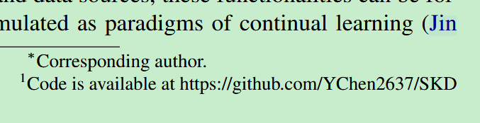
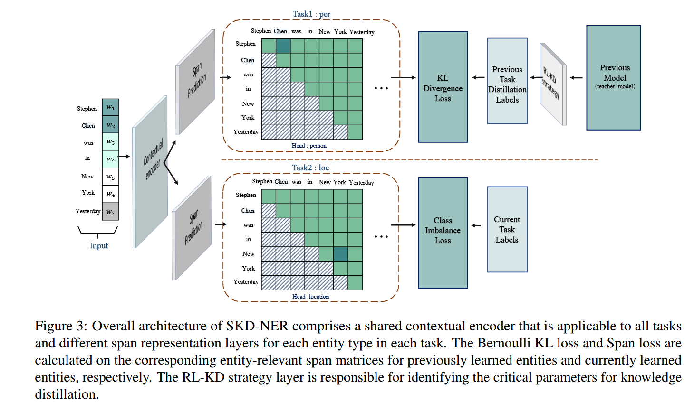

## SKD-NER: Continual Named Entity Recognition via Span-based Knowledge Distillation with Reinforcement Learning

> 这篇文章有点坑爹的一点就是文中提到了github的代码仓库，***进去一看只有个readme
>
> 

提出SKD-NER模型，是一种span-based+reinforcement learning strategies，和大多数CL-NER模型一样，也用到了知识蒸馏，本文加入了强化学习测策略去优化soft labeling和distillation losses

