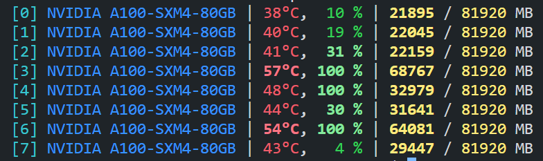
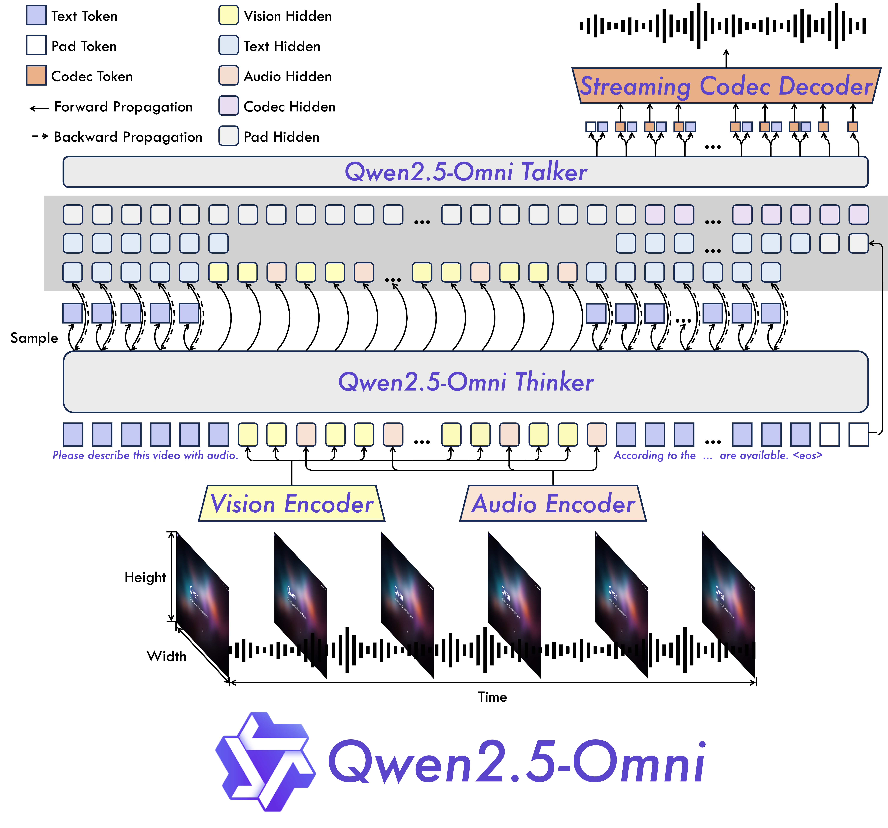
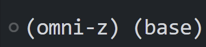
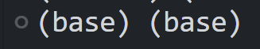

## Qwen系列模型介绍

Qwen也即通义千问，是由阿里研究的系列开源模型，这是国内最强的开源模型，在全世界甚至都很有名气。

## 两个模型初上手体验

最近需要做一个项目，我初步入门研究了下[Qwen2.5系列的文档]((https://qwen.readthedocs.io/zh-cn/latest/index.html))，并尝试跑通了 `Qwen2.5-7B-VL-Instruct`和 `Qwen2-7B-audio`两个模型，并在A100显卡上跑通了代码。

接下来的工作是利用vllm、ollama等工具进行部署，这种部署的好处是持久化加载模型权重进内存，否则在测试的时候我每次运行代码都会重新载入一遍模型，载入时间甚至要超过推理时间。（当然我猜肯定有API可以实现持久化加载，不过我目前还不会）第二个好处就是可以进行多线程加速。



> 深夜八卡A100爽一把(bushi)

## Qwen2.5-omni

我写了一段测试代码第二天早上，就从wx公众号上看到了Qwen更新了Qwen2.5-omni，在统一了四种模态后居然语音性能与Qwen2-7B-audio，其他模态性能与Qwen2.5-7B-VL持平或过之，真的震惊到了我，去[Qwen2.5 Omni: See, Hear, Talk, Write, Do It All! | Qwen](https://qwenlm.github.io/zh/blog/qwen2.5-omni/)中看了一眼，demo效果很震撼，实现的是即时互动对话效果。

这个模型提出的是`Thinker-Talker`架构，是端到端多模态模型。以往对视频模态进行理解的模型是基于抽帧的原理来做的，但是这个模型中利用时间轴对齐实现视频和音频输入的精确同步。



看到这个模型参数的讨论，是一位佬用自己的脚本生成的：

```txt
==================================================
Model type               : qwen2_5_omni
Total param num          : 10.732225408 B
==================================================
model.thinker            : 8.931813888 B
model.talker             : 1.351360256 B
model.token2wav          : 0.449051264 B
model.thinker.audio_tower        : 0.639647232 B
model.thinker.visual             : 0.676550144 B
model.thinker.model              : 7.070619136 B
model.thinker.lm_head            : 0.544997376 B
```

详见：[Qwen/Qwen2.5-Omni-7B · just a question about params](https://huggingface.co/Qwen/Qwen2.5-Omni-7B/discussions/17)

## 这段时间写项目代码的收获

我之前其实是没有写过这种和模型推理相关的工程代码的，也没有接触过A100(手动狗头)，这段时间写的时候了解了很多小技巧，如怎么把进程挂到后台

## 遇到的bug与解决方案

1. 有个比较坑的点在于调用`Qwen2.5-VL`的时候如果用了pip安装的qwen_vl_utils包，大概率会遇到一个函数参数获取错误的报错，升级为0.0.10就可以解决了。

2. [flash-attention](https://github.com/Dao-AILab/flash-attention))是这个模型支持的一个比较重要的机制，但是一直安装不上去显示CUDA版本没有大于11.7，但是我的CUDA版本是12.4，不知道哪里出错了，拉下来其Github的代码进行本地安装也遇到了同样的错误。于是我怒翻`setup.py`安装代码(bushi)，发现了报错位置相关的代码：

   ```python
   if CUDA_HOME is not None:
           if bare_metal_version >= Version("11.8") and "90" in cuda_archs():
               cc_flag.append("-gencode")
               cc_flag.append("arch=compute_90,code=sm_90")
           if bare_metal_version >= Version("12.8") and "100" in cuda_archs():
               cc_flag.append("-gencode")
               cc_flag.append("arch=compute_100,code=sm_100")
           if bare_metal_version >= Version("12.8") and "120" in cuda_archs():
               cc_flag.append("-gencode")
               cc_flag.append("arch=compute_120,code=sm_120")
   ```

​		于是定位到了CUDA_HOME这个变量上，查阅了相关资料，然后通过Linux中环境变量的设置定位到了其指向 `/usr` 这个路径，进去一看发现这里的版本是10.1，谜题解开了！由于CUDA环境变量的错误指向导致了代码安装的错误判断，因此在我自己用户下的`.bashrc`中修改了环境变量到`/usr/local/CUDA12.4` 后问题得到了解决。

> update：我后面仍然在创建新环境时遇到这个问题并且上述方式不奏效，只需要将导入的方式变为在当前环境的命令行中export一下就得到解决了，具体原理是怎么样的仍然未知。

3. 在服务器的多conda环境中有遇到同时显示两个环境的情况：



学长告诉我直接在这种环境下运行甚至可能破坏base环境，我的方法是先：

```bash
conda activate
```

切换到两个都是base的环境：


然后再正常进行切换的命令就可以了。

不过这个应该是vscode的bug，可以直接设置：

```shell
conda config --set auto_activate_base 
```

