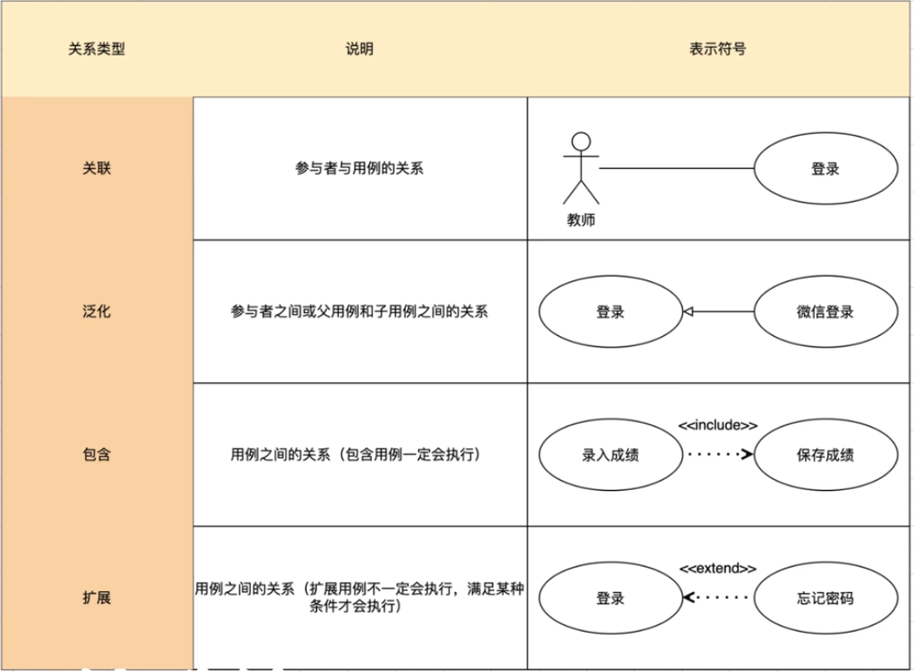
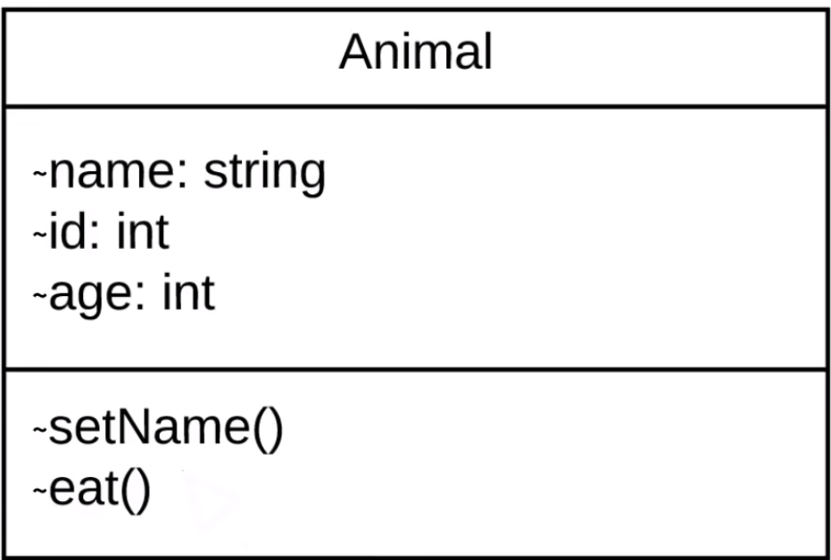
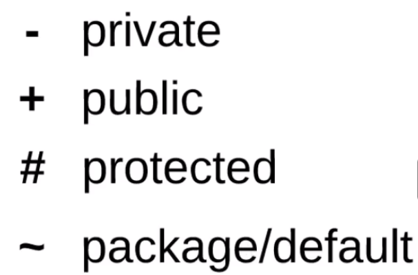

## UML简介

UML：Unified Modeling Language，是一种标准化的可视化建模语言，用于：

* 描述软件系统的结构（静态部分）
* 描述软件系统的行为（动态部分）
* 在业务人员、架构师、开发、测试之间建立无歧义沟通

UML2.5定义了14种标准图，但是大致可以分为两大类：

1. **结构图（Structural Diagrams）**→ **系统由什么组成？**

   > 描述静态架构、组件、关系

| 图类型                          | 中文名     | 重要性（⭐） | 学生重点掌握       |
| ------------------------------- | ---------- | ----------- | ------------------ |
| **Class Diagram**               | 类图       | ⭐⭐⭐⭐⭐       | ✅ **必学！**       |
| **Object Diagram**              | 对象图     | ⭐           | 了解即可           |
| **Component Diagram**           | 组件图     | ⭐⭐⭐⭐        | ✅ 微服务时代极重要 |
| **Deployment Diagram**          | 部署图     | ⭐⭐⭐         | ✅ 云原生必备       |
| **Package Diagram**             | 包图       | ⭐⭐          | 模块化设计有用     |
| **Composite Structure Diagram** | 复合结构图 | ⭐           | 几乎不用           |
| **Profile Diagram**             | 轮廓图     | ⭐           | 高级定制，忽略     |

2. **行为图（Behavioral Diagrams）** → **“系统如何运行？”**

| 图类型                           | 中文名     | 重要性（⭐） | 学生重点掌握            |
| -------------------------------- | ---------- | ----------- | ----------------------- |
| **Use Case Diagram**             | 用例图     | ⭐⭐⭐         | ✅ 需求分析起点          |
| **Sequence Diagram**             | 时序图     | ⭐⭐⭐⭐⭐       | ✅ **必学！**            |
| **Communication Diagram**        | 通信图     | ⭐           | 时序图替代，少用        |
| **State Machine Diagram**        | 状态机图   | ⭐⭐⭐         | ✅ 订单/支付等状态流必备 |
| **Activity Diagram**             | 活动图     | ⭐⭐⭐⭐        | ✅ 业务流程建模          |
| **Interaction Overview Diagram** | 交互概览图 | ⭐           | 复杂流程组合，少用      |
| **Timing Diagram**               | 定时图     | ⭐           | 实时系统专用，忽略      |

我们在一般的场景中只需要知道：类图、组件图、部署图、用例图、时序图、状态机图/活动图就可以。

## 用例图

目的：

* 识别系统边界
* 明确参与者（Actor）和功能（use case）
* 作为后续设计的输入

由参与者（小人表示）、用例（椭圆）、系统（方框+系统名称）边界、参与者之间的关系组成

## 类图

这涉及面向对象的思想与方法以及基本概念。

实例：

关于字段和方法前的可见性符号Visibility：

方框中间部分是Attributes，下半部分是Methods

