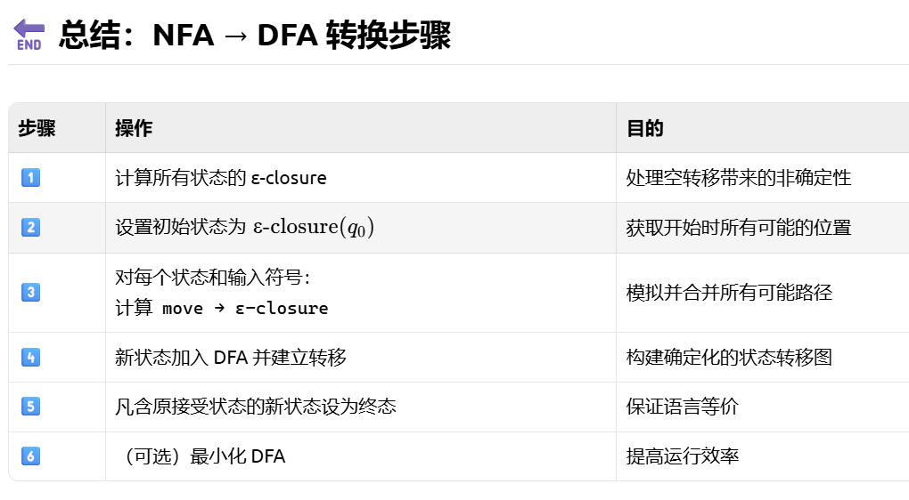
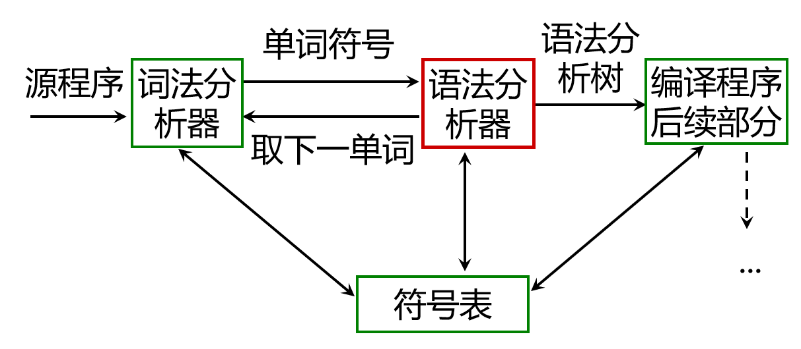
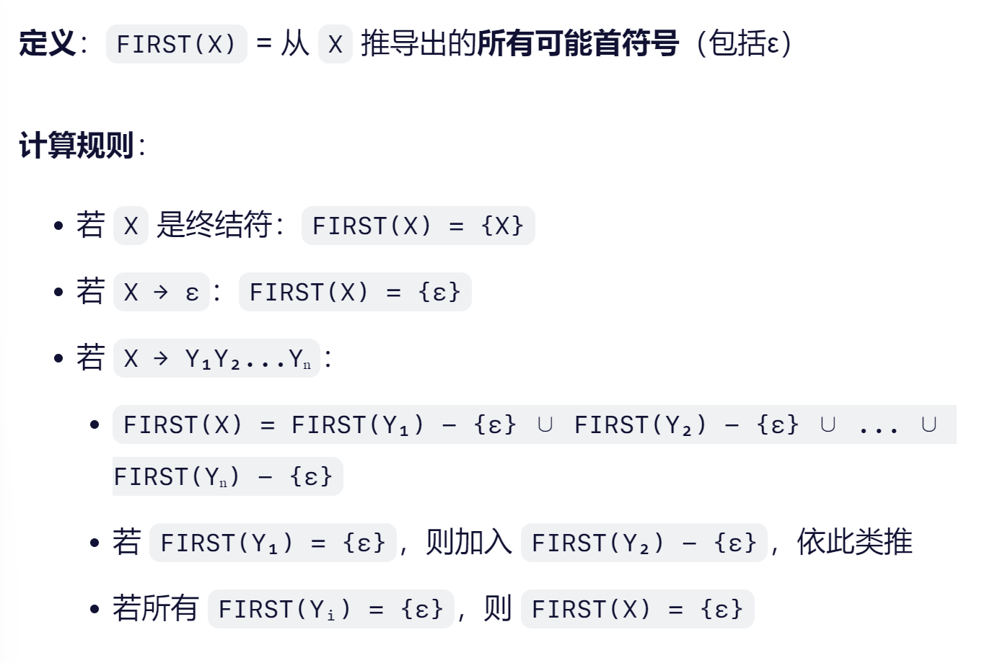
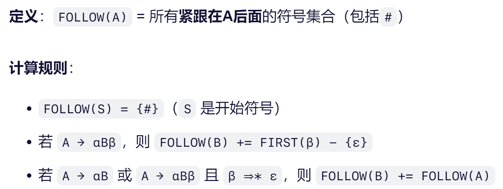
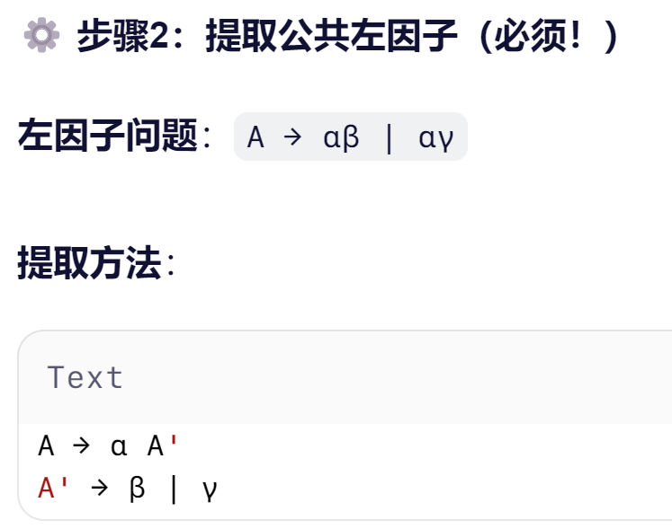

## 课程简介

本课程为西安交大软件学院[徐亦飞老师](https://gr.xjtu.edu.cn/en/web/belonxu_1)教授的2025秋季课程，结合了国防科技大学编译原理课程为基础。

本篇笔记与博客主要为我自己在听课过程中的理解与重点为主，并不是大而全的指南，部分插图为我自己使用[draw.io](https://www.drawio.com/)绘制。

## 第一章 引论

编译中的“递归思想”：

* 递归下降分析
* 基于树遍历的属性计算
* 语法制导翻译

编译的更多应用：shell解释器、SQL、XQuery、HTTP、SAP等。


编译的过程，一般上可以分为：词法分析 -> 语法分析 -> 中间生成（IR） -> 优化 -> 目标代码生成

**词法**

识别与输出token stream，用*有限自动机*描述

**语法**

分解语法单元，用*上下文无关法*描述；

**中间代码**

三元式、四元式、树；

**优化**

依据程序的等价变换规则

**生成目标代码**

任务：将IR转换为特定机器上的目标代码

目标代码有三类：

1. 绝对指令代码：可以直接运行；
2. 可重定位指令代码
3. 汇编指令代码


对于一般的编译器我们可以抽象为下图：

 

以Java语言举个栗子：


## 第二章 高级语言及其语法描述

### 2.1 程序语言的定义

**词法规则**

有限自动机描述

一般：常数、标识符、基本字、算符、界符

**语法规则**

常见语法单位：表达式、语句、分程序、过程、函数、程序等

上下文无关法描述


语义：定义语法单位的意义。

### 2.2 高级语言的一般特性

数据类型三要素：属性、值、操作。

标识符是语法概念，而名字是语义概念

表达式=运算量+算符


左值与右值：

> 左值代表“内存中某个可寻址位置”的表达式，通常是具有名字、生命周期较长的变量或者对象，可以取地址；
>
> 右值：“表示数据本身”的表达式，通常是临时的、无名的结果，不能取地址，使用后即销毁。


### 2.3 程序语言的语法描述

#### 一些概念

有一个**有穷字母表 $\Sigma$ ** 字符集，其中每个元素叫一个**字符**，其中的**字符串**是由其中的字符构成的有穷序列，不包含任何字符的序列称为空字记作 $\varepsilon$ ，该字符集上的全体记作 $\Sigma^*$ (包含空字)

对于字符集V，其自身的n次积记为 $V^n = V V...V$ ，规定$V^0={\varepsilon}$ ；

V的闭包：V中字符组成的所有有限长度的字符串（包括空）构成的集合；即：$V^{*} = V^{0} \cup V^{1} \cup V^{2} \cup V^{3} \cup \dots$

正闭包不包含空字符串。

文法：描述语言的语法结构的形式规则。

#### 上下文无关文法

上下文无关就是：对某个非终结符的重写，与其所处的上下文无关，替换只取决于这个符号本身。

一个上下文无关文法G是一个四元式：$G = (V_T, V_N, S, P)$

* $V_T$：非空终结符集合
* $V_N$：非空非终结符集合，与$V_T$ 交集为空
* S：文法的开始符号，是非终结符
* P：产生式集合（可以理解为非终结符的替换/重写规则）

* S至少必须在某个产生式左部出现一次

**语言**：由某个文法G所生成的所有“合法句子”的集合，通常记作L(G)

**句子**：从其实符号推导出的、仅包含终结符的字符串，是一个完整的程序/表达式

**句型**：从S推导过程中产生的任意中间形式（可能包含非终结符），包括句子本身和中间步骤

> 所有的句子都是句型，但是反之不一定正确。

最左推导和最右推导指的是推导过程中对于哪个位置的非终结符先进行替换。

#### 语法树与二义性(ambiguity)

**语法树**：可以表示一个句型的推导。

**文法的二义性**：如果存在至少一个句子，它有两个不同语法树。

> 可以引申出要判断一个文法是否二义，只需要找到某个句子，它可以构造出两颗以上的不同语法树，这样就是二义的。

如果每个句型最多对应一颗语法树，则：

1. 文法非二义；
2. 使用某种固定推导策略（如最左推导）


## 第三章 词法分析

### 3.3 正规表达式与有限自动机

#### 3.3.1 正规表达式

正规集（Regular Set）：定义在某个字母表上、能被“有限自动机"识别的**语言集合**，也就是可以用正规表达式表示的形式语言。

正规集是通过字母表上的运算递归构造出来的其定义如下：

设 $\Sigma$ 是一个字母表，则在其上定义的**最小的集合族**，满足以下条件的都称为**正规集**：

| 规则                                                         | 解释                   |
| ------------------------------------------------------------ | ---------------------- |
| 1. $\emptyset$ 是正规集                                      | 空集，不包含任何字符串 |
| 2. $\{\epsilon\}$ 是正规集                                   | 只包含空串 $\epsilon$  |
| 3. 对每个 $a \in \Sigma$，集合 $\{a\}$ 是正规集              | 单个字符构成的集合     |
| 4. 若 $A$ 和 $B$ 是正规集，则：  • $A \cup B$ （并）  • $AB$ （连接）  • $A^*$ （Kleene闭包）  都是正规集 | 封闭于三种基本操作     |

> 正规表达式就是正则表达式，只是翻译不同，英文中都是Regular Expression；

不那么正式的定义来说正规集：

1. 它是一类结构简单但实用性强的语言（即字符串集合）
2. 这些语言可以用正则表达式描述，也可以用NFA/DFA实现识别
3. 一个字集合是正规集当且仅当它能用正规式表示

**Kleene定理（Kleene's Theorem）**：每一个正规集都可以用一个正则表达式表示，并且存在一个有限自动机可以识别他；反之亦然

> 所以正规集、正规表达式、有限自动机在概念本质上是等价的

#### 3.3.2 确定有限自动机（DFA）和非确定有限自动机

在谈论DFA前，先看看什么是有限自动机（Finite Automation，FA）。

**有限自动机**是一种抽象的计算模型，用来识别某个字符串是否属于一个“正规集”。有以下特点：

* 只有有限个状态
* 根据输入符号从一个状态转移到另一个状态
* 能判断一个字符串是否被接受（即是否属于该语言）

**确定有限自动机和非确定有限自动机的区别**：

* DFA每个状态对每个输入符号最多只有一个下个状态，NFA一个状态对于同一输入可以跳转到多个状态
* DFA没有空转移，NFA可以通过 ε 不读输入转移到其他状态
* DFA应用于实际编译器中高效匹配Token，NFA是理论建模和正则表达式转换中间步骤
* NFA可以有多个初态，NFA的弧上标记可以是一个字甚至一个正规式，而不一定是单个字符

DFA可以对状态图进行形式化，状态转换图可以表示DFA，在词法分析阶段，DFA是实现正则表达式匹配、识别Token的核心理论工具。

(DFA) M=(S, $\Sigma$, f, $S_0$, F)，分别是：有穷状态机、有穷输入字母表、状态转换函数、唯一初态、终态集（可空）

> 如果终态集为空，那么表达没有任何状态是接受状态，也就是这个DFA不接受任何字符串，即其识别的语言是：
>
> $L(M)=\emptyset$ ，即空语言

DFA M所识别的字的全体记为$L(M)$

\(\varepsilon\) 表示空字符串，DFA 中，若初始状态同时是接受状态（用双圈表示），则该 DFA 能识别空字符串。

关于终态：表示的是在FA完全处理完输入字符串后处于终态，那么该字符串被NFA接受，其本质是一个判定点而非终止点。

**NFA和DFA**

二者描述能力相同，对每个NFA M，都存在一个DFA M‘，使得其所识别字的全体相同。

#### 3.3.3 子集构造法（Subset Construction）

**理解**：对于NFA，其非确定性意味着某个时刻，自动机可能同时处于多个状态，这种多个状态的“状态集合”就是DFA的一个单一状态。也就是说，本质上子集构造法是将NFA的状态子集视为DFA的一个状态，

又称幂集构造，是NFA转化为等价的DFA的标准方法。

1. 预处理——计算$\epsilon$-闭包

对于某个状态集合s，其$\epsilon$-闭包是：从S中每个状态出发，只通过空转移能到达的所有状态的集合（包括自身）

2. 构造初始状态

DFA的初始状态是：$D_0=\epsilon-closure(q_0)$ ，$q_0$是NFA的起始状态

3. 生成新状态（逐个字符扩展）

对当前已知的每个DFA状态，比如集合 $D = \{q_1, q_2, ...\}$：

对 **每一个输入符号 a ∈ Σ**：

* 找出从 D 中每个状态出发、读入 `a` 后能到达的 NFA 状态：

$$
\text{move}(D, a) = \{ p \mid \exists q \in D,\ \delta(q, a) = p \}
$$

* 再把这些状态做 ε-闭包：

$$
D' = \text{ε-closure}(\text{move}(D, a))
$$

* 如果这个新的状态集合 $D'$ 尚未出现在 DFA 中，则将其加入待处理队列。

* 在 DFA 中建立转移：$\delta_{\text{DFA}}(D, a) = D'$

🔁 重复此过程直到没有新的状态产生。

4. 确定哪些是终态

 在*DFA 中，只要某个状态对应的 NFA 状态集合* **包含了至少一个原 NFA 的接受状态**，那么该 DFA 状态就是接受状态。

5. 最小化DFA

使用状态划分法或Hopcroft算法将得到的DFA化简，去掉冗余状态，提高效率。



在这个过程中，$\epsilon$-转移的影响已经被”编译”进了DFA的状态设计中，运行时不需要显式的空转移动作。 

## 第四章 语法分析——自上而下分析

在语法分析阶段使用CFG描述语法规则，其表达能力足够强大而又足够简单，可以构造有效的分析算法来检验一个给定字符串是否由某个上下文无关文法产生。

词法分析采用正规式和有限自动机即可表达词法规则。



**自上而下分析**

从文法的开始符号出发，通过推导构建语法树或寻找最左推导序列，以验证输入结构的合法性。

### 4.1 基本概念

**语言（Language）**：给定文法G，所有能从开始符号S推导出的终结符串的集合，记作L（G）；

**句型（Sentential Form）**：从文法开始符号S出发，经过任意步推导（包括0步）得到的符号串（可以包含终结符和非终结符）；

**句子（Sentence）**：只由终结符组成；

**短语**：在某个句型中，可以被某条文法规则整体替换掉的一段字串；也就是句型中某个非终结符通过若干步推导得到的子串，可以是间接的。

* 即这个子串是“合法地从某个非终结符生长出来的”，无论用了几步

**直接短语（Immediate Constituent / Direct Phrase）**：在某个句型的语法树中，如果某个非终结符A通过一步推导**直接推导**出一个子串B，即存在产生式A->B，则B是该句型的一个直接短语

> 一个句型可能有多个直接短语

**句柄（Handle）**：最左边的直接短语，是自下而上规约时的“第一个下手目标”

> 自底向上分析器（如LR（1））的工作方式就是不断在输入串中寻找句柄，然后用对应的产生式左部规约它。

**找短语的方法**：逆向思考，哪些字串曾经是一个非终结符（非终结符本身就是短语）

**最左/右推导**：每一步推导中，总是选择最左/右边的非终结符进行替换。引申出最（）句型的概念，即在最（）推导中产生的任意中间句型

### 4.2 自上而下带来的问题

这里实际是带回溯的递归下降分析的问题。另一种不带回溯的递归下降分析属于LL（1）的一种具体实现

即回溯采用穷尽一切可能的试探法，效率很低；含有左递归的文法会导致无限循环（如 `P → Pα`）

### 4.3 LL（1）分析法

> 这是实际编译器设计中，自上而下分析法最常用的实现

#### 4.3.1 原理

> 需要消除文法的左递归；克服回溯

第一个L：从左到右扫描输入串

第二个L：产生最左推导

文法中每个非终结符A的各个产生式的候选首符集两两不相交

1：每次向前看一个符号

核心思想：通过预测分析表，避免回溯，直接确定下一步应该应用的产生式

**消除左递归**

假如左递归：$P \rightarrow P\alpha| \beta$ ，其中$\beta$ 不以P开头。

可以把P的规则等价改写为：

$P\rightarrow \beta P'$

$P'\rightarrow \alpha P'|\epsilon$

#### 4.3.2 关键概念

**FIRST集合**：

* 对于文法符号X，FIRST(X)是所有可以从X中推导出的首终结符集合
* 如果X可以推出$\epsilon$ ，则其也在FIRST(X)中



**FOLLOW集合**

* 对非终结符A，FOLLOW(A)是所有紧跟在A后面的终结符集合
* 如果A可以出现在句型末尾，则#（输入结束符）也在FOLLOW(A)中



**预测分析表**

* 表的行是文法的非终结符
* 列是终结符（包括#）
* 单元格包含产生式，表示的是当处于该非终结符且下一个输入符号是该终结符时应该用的产生式

#### 4.3.3 实现步骤

1. 消除文法中的左递归
2. 提取公共左因子



1. 计算每个非终结符的FIRST集合
2. 计算每个非终结符的FOLLOW集合
3. 构建预测分析表
4. 使用预测分析表进行语法分析

**分析过程**

1. 初始化：将开始符号S压入分析栈，输入指针指向输入串第一个符号
2. 当栈顶是终结符时：
   - 匹配输入符号则弹出栈顶并移动输入指针
   - 否则报告语法错误
3. 当栈顶是非终结符A时：
   - 查找预测分析表中A行和当前输入符号列对应的产生式（即查表M[A, a]得到应使用的产生式）
   - 如果存在，弹出A，将产生式右部逆序压入栈
   - 如果不存在，报告语法错误
4. 重复步骤2和3，直到栈空或发生错误

#### 4.3.4 FIRST集和FOLLOW集的理解

核心作用：让LL(1)分析器直接能选择当前输入符号该用哪个产生式，无需回溯。

$FIRST(X) = { a | X ⇒* aβ }$

**计算规则**：

1. X为终结符，`FIRST(X)={X}`
2. X->$\epsilon$ 则`FIRST(X)={$\epsilon$}`
3. **若 `X → Y₁Y₂...Yₙ`**，`FIRST(X) = (FIRST(Y₁) - {ε}) ∪ (FIRST(Y₂) - {ε}) ∪ ... ∪ (FIRST(Yₙ) - {ε})`，其中 i 为第一个Yi不为空的，**若所有 `FIRST(Yᵢ) = {ε}`**，则 `FIRST(X) = {ε}`

计算规则最后一条实则是在找第一个能贡献实际首字符的集合。

> 这里减去空串是因为：Y1如果能推出空，则其不贡献首符号，需要看下一个，减去是为了表示对应的Yi能贡献的实际首符号；


FOLLOW(A)集是A后面可能跟着的终结符符号，计算规则：

* **`FOLLOW(S) = {#}`**
* **若 `A → αBβ`**，FOLLOW(B) += FIRST(β) - {ε}
* **若 `A → αB` 或 `A → αBβ` 且 `β ⇒\* ε`**，FOLLOW(B) += FOLLOW(A)

#### 4.3.5 间接左递归消除方法

间接左递归也会导致自顶向下语法分析器陷入无限循环。

**消除的基本思路**：先将间接左递归化为直接左递归，然后应用直接左递归的消除方法。

**消除算法**：

1. 对非终结符排序：将文法中的所有非终结符按某种顺序排列（P₁, P₂, ..., Pₙ）
2. 依次处理每个非终结符：替换间接递归并消除直接左递归
3. 化简文法：删除从开始符号出发永远无法到达的非终结符的产生式

### 4.4 递归下降分析程序构造


## 第五章 语法分析——自下而上分析

### 5.1 自下而上分析的基本问题

**自下而上分析法**

**核心思想**：从输入串开始，逐步将其规约（reduce）为文法的起始符号（通常为$）。从树的末端开始，构造语法树。

关键操作即：移进（shift）和规约（Reduce）

还有两个辅助动作：

* Accept（接受）：当栈中只有开始符号S且输入结束时，分析成功
* Error：无法移进也无法规约时，语法错误

**关键概念**

* 句柄 Handle：某个产生式右部的一个子串，将其替换为对应非终结符，就能得到输入句子最右推导的前一步
* 句柄也叫可规约串（Reducible String），可规约串不一定全是终结符

**常用方法**：

1. 算符优先分析法（Operator Precedence Parsing）
   * 应用于表达式文法（如算数表达式）
   * 利用算符之间的优先级关系来决定
   * 简单快速，但是仅适用于“算符优先文法”
2. LR分析法（Left-to-Right，Rightmost derivation in reverse）
   * 现代编译器广泛使用的技术（如Yacc/Bison工具基于LR）

| 类型                         | 描述                                                         |
| ---------------------------- | ------------------------------------------------------------ |
| **LR(0)**                    | 最简单形式，不使用展望符（lookahead），常存在冲突            |
| **SLR(1)**（Simple LR）      | 在 LR(0) 基础上加入 FOLLOW 集来解决部分冲突，能力较弱但仍优于 LL |
| **LR(1)**                    | 完整版，每个项目都带有一个展望符（lookahead terminal），非常精确，但状态爆炸 |
| **LALR(1)**（Look-Ahead LR） | 在 LR(1) 基础上合并等价状态，兼顾能力与效率，Bison 默认生成 LALR(1) 分析器 |


**句柄Handle**的正式定义：在某个规范推导（最右推导）过程中，当前句型中能通过一步反向推导归约，并最终导向起始符号的最左子串，称为该句型的句柄。

> 这里有个我理解的误区，最右推导意味右边先成形，所以在规约时候应该最先还原最左边的那些“后来生成”的部分，因此句柄是最左子串


**规范规约**

定义：n假定a是文法G的一个句子，我们称序列

$\alpha_n,\alpha_{n-1},...,\alpha_{0}$

  是a的一个规范归约，如果此序列满足：

1. an= a
2. a0为文法的开始符号，即a0=S
3. 对任何i，0<=i<=n， ai-1是从ai经把**句柄替换**成为相应产生式左部符号而得到的

> 不难发现，规范规约是最右推到的逆过程。

由规范推导出的句型称为规范句型。

栈是语法分析的基本数据结构，#是栈底符号。

#### 对于PPT中一个示例的解释


这里我开始疑惑为什么短语、直接短语和句柄中没有F、T等符号，后来明白：

1. 对于一个句型，其短语、直接短语和句柄，都只能由该句型中实际出现的符号组成，不能包含文法中存在但是句型中没有的符号
2. 所有这些概念都是针对当前句型的子串定义的，它们是句型的子串，不是文法中的任意符号组合


**关于PPT中直接短语的一个通俗解释**：

在语法树里，随便挑一个非终结符（比如 `T`），把它当成小树的根：

- 把它下面所有的**叶子符号**按从左到右顺序连起来，得到一个子串；
- 这个子串就叫做**关于这个非终结符的一个短语**。

特别地：

- 如果这个小树**只有两层**（根直接连到叶子，中间没其他非终结符），
  那么这个短语就是**直接短语**（因为文法中有一条规则直接生成它）。
- 如果小树有**三层或更多**，那就是普通短语（需要多步推导）。


### 5.2 算符优先分析算法

#### 5.2.1 基本概念

 **算符优先分析法（Operator Precedence Parsing）是一种用于自下而上语法分析的技术，专门针对表达式文法设计。**

它通过定义任意两个相邻运算符（或终结符）之间的**三种优先关系**，来确定何时进行归约（reduce），而无需构造完整的语法树或使用状态机。

> 核心思想：*❝ 我不知道整个句子的结构，但我可以看“左边算符”和“右边算符”谁更“强”，从而决定先归约哪一部分。 ❞*

* 只关心相邻**终结符**之间的关系

- 把所有规约决策建立在“哪个算符该先处理”的基础上

所以它被称为“**孤立地看算符之间的优先性**”的方法。

**本质缺陷总结**：

1. **忽略非终结符的影响**
    相同算符序列但在不同非终结符环境下行为应不同，但它无法感知。
2. **无法处理所有上下文**
    如：`a + (b + c)` 中，括号内即使 `+` 优先级低也必须优先计算 → 实际靠 `=·` 和 `·>` 控制，但易出错。
3. **不是通用方法**
    很多语言结构（赋值、条件、循环）无法用算符优先描述。
4. **可能导致错误规约**
    因为只依赖局部算符对比，缺乏全局视角。

#### 5.2.2 **算符文法**

所有产生式的右边，任意两个非终结符之间至少要有一个终结符隔开。

> 这是为了保证，每两个运算（或语法结构）之间，都有一个明确的“运算符”可以来判断优先关系

**任意两终结符之间关系的三大判断规则**：

假定G为一个不含$$\epsilon-$$产生式的算符文法，对于任何一对终结符a、b，有如下关系

| 优先关系   | 判定条件                                         | 解释                                 |
| ---------- | ------------------------------------------------ | ------------------------------------ |
| **a =· b** | 存在产生式 `P → ...a b...` 或 `P → ...aQb...`    | 通常出现在括号配对等情况             |
| **a <· b** | 存在产生式 `P → ...aR...` 且 `R⇒+b...或R⇒+Qb...` | 应该继续移进（shift）b，因为其更紧迫 |
| **a ·> b** | 存在产生式 `P → ...Rb...` 且 `R⇒+...a或R⇒+...aQ` | 可以将前面包含a的短语规约（reduce）  |

> 算符优先级的比较本质上是在比较算符在语法层面上的深浅

#### 5.2.3 FIRSTVT和LASTVT集

这两个集合的计算是优先级关系计算的基础。

FIRSTVT(P)={a | p => a... 或P => Qa...}，其中a是终结符，Q是非终结符：

1. 若有产生式P→a...或P→Qa...，则a∈FIRSTVT(P)
2. 若有a∈FIRSTVT(Q)，且有产生式P→Q...，则a∈FIRSTVT(P)

LASTVT(P)={a | P => ...a 或 P=>...aQ}，其中a为终结符，Q非终结符

#### 5.2.4 算符优先关系表


1. 列出文法中所有终结符，包括特殊符号以及边界标记；
2. 计算FIRSTVT和LASTVT集，从而构建三大优先关系；
3. 创建一个大小 $$n\times n$$ 的表格，所有单元初始化为空；
4. 遍历所有产生式，分别寻找三种关系；
5. 检查表中是否存在冲突，如果存在则说明该文法不是算符优先文法

> 同一运算符之间也具有优先级关系，这使得分析器能够正确处理连续出现的相同优先级运算符


**素短语（Prime Phase）**：至少含有一个终结符；本身是一个短语；其内部不再包含任何其他短语。

**最左素短语**：处于句型最左边的素短语


#### 5.2.5 算符优先函数


基本思想：起决定作用的是相邻的两个算符（终结符）之间的优先关系。

**算符文法（Operator Precedence Grammar，OPG）**：一个文法，它的**任一产生式**的右部不含两个并列相邻的非终结符（即...QR...这样的推导式右部），则为算符文法。

> 我理解对于非终结符之间必须有作为“符号或运算符”的终结符，以此来形成其规约优先级

**算符优先文法**在此基础上还多了一个约束：

* **优先关系唯一**：任意两个终结符之间，至多存在一种优先关系
* 以上约束的本质是二义性文法，要能够构造无冲突的优先关系表
* 不含$\epsilon$-产生式

**符号优先级的定义**：

1. `a = b` 当且仅当文法G中含有形如P→…ab…或P→…aQb…的产生式；
2. `a < b`当且仅当G中含有形如P→…aR…的产生式， 而R $\Rightarrow^+$ b…或R$\Rightarrow^+$ Qb…
3. `a > b`  当且仅当G中含有形如P→…Rb…的产生式，而 R $\Rightarrow^+$  …a或R  $\Rightarrow^+$ …aQ


FIRSTVT(A) = 从非终结符 A 推导出的串中，第一个可能的终结符的集合；

LASTVT(A) =从非终结符 A 推导出的串中，最后一个可能的终结符的集合

> 需要这两个集合是因为


算符优先分析：文法规则 -> 计算FIRSTVT/LASTVT -> 构建优先关系表 -> 移进-规约分析

**优先关系表构造**：

1. 对于等于关系，可以检查文法中所有产生式得到，而剩余两种关系不易检查，因此需要定义FIRSTVT和LASTVT；
2. FIRSTVT(P) = {终结符 a | P ⇒⁺ aα 或 P ⇒⁺ Qaα}，P 能推导出以a开头的串，或以非终结符Q后紧跟a开头的串；若a∈FIRSTVT(Q)，且有产生式P→Q⋯，则a∈FIRSTVT(P)，Q的首终结符也是P的首终结符
3. **LASTVT(P)** = { 终结符 a | P ⇒⁺ αa 或 P ⇒⁺ αaQ }，（P能推导出以a结尾的串，或以a后紧跟非终结符Q结尾的串）；若a∈LASTVT(Q)=，且有产生式P→⋯Q=，则a∈LASTVT(P)
4. 如两个集合构造好，检查P就可确定满足⋖和⋗的（a，b）对；
5. 这是因为，假定有个产生式候选式：
   - ⋯aP⋯，那么对于任何b∈FIRSTVT(P)，有a⋖b
   - ⋯Pb*⋯，那么对于任何a∈LASTVT(P)*，有a⋗b

因此该问题可以总结为：

* 构造这两个集合的算法，即对每个非终结符P都构造其FIRSTVT和LASTVT
* 使用每个非终结符的这两个集合，检查每个产生式，构造优先关系表

### 5.3 LR分析法

根据向前查看符号的数量和分析表的构造方法，LR分析法主要分为以下几种：

* LR(0)：不向前查看任何输入符号

- **SLR(1)**：简单 LR，向前查看 1 个输入符号

- **LR(1)**：标准 LR，向前查看 1 个输入符号

- **LALR(1)**：向前 LR，向前查看 1 个输入符号

一个**LR分析器的组成**：

1. 输入缓冲区：存放待分析的输入符号串
2. 分析栈：存储状态信息和文法符号
3. 分析表：包含动作表（ACTION）和转移表（）GOTO
4. 总控程序：控制整个分析过程

**LR 分析器的工作过程**可以概括为：

1. **初始化**：将初始状态 S0 和句子左界符 #推入分析栈
2. **状态查询**：根据当前栈顶状态和输入符号查询分析表
3. **执行动作**：根据分析表的指示执行相应动作（移入、规约、接受或错误）
4. **重复执行**：直到分析成功或遇到错误

LR 分析表由两个子表组成：

**动作表 (ACTION)**：

- ACTION [S, a] 表示当栈顶状态为 S 且输入符号为 a 时应执行的动作

- 可能的动作包括：移入 (shift)、规约 (reduce)、接受 (accept)、错误 (error)

**转移表 (GOTO)**：

- GOTO [S, X] 表示当栈顶状态为 S 且遇到非终结符 X 时应转移到的状态

- 用于**规约操作后**的状态转移


LR 分析器主要执行以下四种操作：

2.3.1 移入操作 (Shift)

当 ACTION [S, a] = "shift s" 时：

1. 将输入符号 a 压入符号栈

1. 将状态 s 压入状态栈

1. 输入指针向前移动一个位置

2.3.2 规约操作 (Reduce)

当 ACTION [S, a] = "reduce A→β" 时：

1. 从栈顶弹出 |β| 个符号和 |β| 个状态

1. 将非终结符 A 压入符号栈

1. 根据新的栈顶状态 S' 和非终结符 A，查询 GOTO [S', A] = s

1. 将状态 s 压入状态栈

2.3.3 接受操作 (Accept)

当 ACTION [S, #] = "accept" 时：

- 分析成功完成，输入符号串被成功分析

2.3.4 错误操作 (Error)

当 ACTION [S, a] = "error" 时：

- 发现语法错误，调用错误处理程序


为了构建LR分析表，需要构造一个识别活前缀（viable prefixes）的DFA，关键工具是LR（0）项（Item）


## 第六章 属性文法和语法制导翻译

> 这部分属于是编译器前端的语义分析阶段，上一章的语法分析器只能判断一个程序是否符合语法规则，但是无法处理语义信息。
>
> 属性文法用来描述语义规则

**属性文法** 和 **语法制导翻译** 正是将**语义动作**（semantic actions）**与语法规则紧密结合**的形式化框架，使得我们可以在语法分析的同时完成：

- 类型检查
- 符号表管理
- 常量折叠
- 中间代码生成（如四元式、三地址码）
- 错误报告

语法制导翻译（Syntax-Directed Translation, SDT）：属性文法是声明式的（描述计算什么），SDT 是其操作式实现（描述何时计算）

### 节点

接下来章节中的节点指的是，用上下文无关文法（CFG）对一个句子进行语法分析时，构建一颗语法树，这个树的每个内部节点对应一个非终结符，每个叶节点对应一个终结符，父子关系由产生式的展开决定

### 6.1 属性文法（也称属性翻译文法）

基本思想：用于**为上下文无关文法（CFG）的每个文法符号（终结符或非终结符）附加“属性”（attributes）**，并通过**语义规则（semantic rules）** 描述这些属性如何计算。

>  属性 = 与文法符号关联的语义信息（如类型、值、地址、代码片段等），是一种“值”
>
> 属性可以进行计算和传递
>
> 语义规则：对于文法的每个产生式都配备了一组属性的计算规则

属性和变量一样，可以进行**计算**和**传递**。

**属性分类**：

1. ###### 综合属性(Synthesized Attribute)

   1. 自下而上传递信息：根据右部候选式中的符号的属性计算左部被定义符号的综合属性
   2. 根据子节点属性和父节点自身属性计算父节点的综合属性；
   3. 适用于所有分析方法（包括自底向上如LR）
   4. **不要求使用右部所有符号，不要求每个符号的所有属性**，只需使用语义上必要的属性

2. 继承属性(Inherited Atrribute)

   > 这里的继承是语法树中的上下文传递，不是面向对象的概念！

   * 由父节点或兄弟节点的属性计算得到子节点的**继承属性**；
   * 自顶向下或横向传递；
   * 在自顶向下分析中自然支持，但是 LR 中需特殊处理
   * 可以很方便的表示程序设计语言结构中的**上下文依赖关系**
   * 是产生式右部某个符号的属性，依赖其自身左边的**部分**兄弟节点的属性或者左部非终结符的属性

**注意：L -属性文法包含了 S-属性文法，但是 L 属性文法也不是全体的属性文法**

**语法制导翻译**

SDT 的基本形式：**在产生式右部嵌入语义动作（semantic actions）**，通常是花括号包裹的代码片段。

```Bnf
E → E1 + T { E.val = E1.val + T.val; }
```

这些动作在语法分析中被执行。

### 6.2 语义规则

> 对于文法每个产生式都配备一组属性的计算规则

在一个属性文法中，对于每个产生式 $A \rightarrow \alpha$ 都有对应的语义规则，每条规则的形式：$b := f(c_1, c_2, ..., c_k)$ ，$f$ 是函数：

1. b是 A 的综合属性且 $c_k$ 是产生式右边文法符号的属性；
2. **或**b 为右边某个符号的继承属性并且 $c_1, c_2, ..., c_k$ 是 A 或产生式右边任何文法符号的属性

以上都算是属性 b 依赖于属性 $c_1, c_2, ..., c_k$ 

**仅仅使用综合属性文法成为 s-属性文法** 

#### 强调

- 终结符只能有预定义的综合属性，由词法分析器提供；
- 非终结符既可以有综合属性也可以有继承属性，文法开始符号的所有继承属性作为属性计算前的初始值；
- 对出现在产生式右边的继承属性和出现在产生式左边的综合属性都必须提供一个计算规则；
- 出现在产生式左边的继承属性和出现在产生式右边的综合属性不由相应产生式的属性计算规则进行计算，它们由其他产生式的属性计算规则或者由属性计算器的参数提供；

继承属性用于传递上下文信息，让某个语法结构知道其“所处环境”，但是终结符本身不构成所谓的结构，只是一个原子符号，提供原始数据，而非参与语义结构的构建。

### 6.3 基于属性文法的处理方法

处理过程：输入串 -> 语法树 -> 依赖图 -> 语义规则计算次序

这样通过源程序语法结构的处理方法就是语法制导翻译，语义规则的计算可能**产生代码、在符号表中存放信息、给出错误信息或者执行任何其他动作**。对输入符号串的翻译也就是根据语义规则进行计算的结果。

语法制导翻译会在每次应用产生式时出发动作

#### 6.3.1 依赖图的属性计算方法

依赖图（dependency  Graph）是属性文法中用于分析属性计算顺序的辅助工具，其唯一目的：**判断属性文法是否良定义**（well-defined）——即所有属性能否被无歧义的计算出来。

> 显式刻画所有属性之间的依赖关系，检查是否存在环。
>
> * 无环 -> 文法合法
> * 有环 -> 文法无效

#### 6.3.3 一遍扫描的处理方法

依赖图和语法树都需要多遍扫描。

S-属性文法适合一遍扫描的自下而上分析

L–属性文法适合一遍扫描的自上而下分析

- 一遍扫描的处理方法是**在语法分析的同时计算属性值**，而不是语法分析构造语法树之后再进行属性的计算
- 一遍扫描处理方法与下面两个因素密切相关
  - 所采用的语法分析方法
  - 属性的计算次序


## 第七章 中间代码生成

中间代码生成是词法分析和语法分析之后的工作，语义分析处于中间代码生成比较前面的阶段。

中间代码生成**几乎全部依赖语法翻译制导**实现。

### 7.1 语法制导翻译

在语法分析过程中，根据每个产生式所对应的语义子程序（语义动作）进行翻译（产生中间代码）的方法。

一个产生式中同一符号多次出现，用下标来区分：

- 例如E→E+E*E*→*E*+*E*表示为E→E1+E2*E*→*E*1+*E*2


### 7.2 中间语言


#### 7.2.1 逆波兰表达式（后缀式）


#### 7.2.2 树


## 随堂测验

### 01

1. 翻译程序定义涉及：源语言和目标语言；编译程序涉及：高级语言源程序和面向机器代码。>

> 前者是一个广义的概念，包含所有的语言转换工具，后者是狭义概念，特指高级->低级的翻译。

2. 编译过程中与中间代码有关的是代码优化和目标代码生成，无关的是词法分析和语法分析。
3. 编译程序架构中的表格管理器和出错处理器可视为公共模块，语法分析器（Parser）和代码优化器（Code Optimizer）不算；

> 编译程序架构中，common modules 指的是被多个主要编译阶段共享或调用的基础性支持模块，他们不直接对应某个特定的编译阶段，，而是为整个编译过程提供通用服务。
>
> 表格管理器管理符号表，记录变量、函数等标识符的信息哦；出错处理器是检测、报告并尝试恢复编译过程中出现的词法、语法、语义等错误

4. 编译程序处理源程序的：语法错误、语义错误、词法错误

> 语义错误：语法正确语义非法，如类型不匹配、未声明变量、函数调用参数个数不符等。编译器可以检测大多数静态语义错误，但是有些运行时语义错误无法检测

5. 编译程序可能涉及的软件架构风格：黑板风格、串行化批处理风格、主程序/子程序风格；不涉及管道-过滤器风格

> 批处理化，一次读入源程序，按阶段顺序处理；
>
> 子程序/主程序是编译器工作原理；

6. 编译前端：词法分析器、语法分析器、中间代码生成器；编译后端：代码优化器（与目标机器相关的优化）、目标代码生成器

7. T 型图用于描述编译器的构造过程，S（Source）为输入语言[该编译器能编译的语言]、T（Target）为目标语言[该编译器生成的目标代码所针对的机器/语言]、I（Implementation）实现语言[该编译器本身是什么语言写的]；**一个编译器可记作：从 S 到 T，用 I 实现，即 S->T, written in I**

8. 设计词法分析器可用策略：作为单独一遍与作为子程序；**不可用**：作为主程序、作为过滤器
9. 手工构建词法分析器包括哪些步骤：
   * 根据语言的单词表设计状态转换图(正确答案)
   * 根据语言的单词表构造正规式
   * 给出语言的单词规范（即单词表）
   * 根据状态转换图编写词法分析程序(正确答案)

10. 正规式的基本运算：链接运算、选择运算（或，并运算）、闭包运算

> 闭包运算记作*，表示前面的表达式可以重复 0 次或多次；
>
> **不包含与运算**

### 02 

1. DFA 和 NFA 的区别：
   * 初态是否唯一
   * 转换是否确定
   * 箭弧标记是否为字/串（NFA 可以是空串转移）
   * **二者终态集都可以为空**

2. 确定化 NFA 应该：引入唯一初态、使用子集法构建状态转换矩阵

3. 化简 DFA 应该：初次划分包括终态集与非终态集、检查一步转换状态子集是否包含于当前划分、划分结束后从每个状态子集选一个代表

> 终态和非终态对于空串的响应不同（一个接受一个拒绝）

4. CFG 上下文无关文法四元式：非终结符与终结符集非空有穷、产生式集非空有穷；开始符号是一个单一符号，没有所谓的**开始符号集**
5. CFG 的终结符是：关键字/标识符、界符/运算符、整常数/实常数
6. 全体句子（终结符串）构成的集合为语言；全体句型构成的符号是句型集
7. 每个非终结符都必须有用的含义：
   * 其在句型中会出现
   * 其经推导会成为句子
   * 其不存在不终结的回路

8. 文法与语言二义性的认识：
   * 语言是否固有二义是一个不可判定问题
   * 语言若有无二义文法则其无二义
   * 无法判定文法是否无二义
9. 自上而下语法分析时必须首先解决的问题：回溯和文法左递归

### 03

1. 关于首符集与后继符集的哪些认知正确？
  每个文法符号及候选式都有首符集(正确答案)

  > 终结符的是自身

  仅非终结符才有后继符集(正确答案)
  首符集本质上是首终结符集
  首符集与后继符集的求解存在耦合(正确答案)

  > 计算 FOLLOW 要用到 FIRST 集

2. 如何判断一个文法是否为 LL(1)文法？
  其预测分析表是否有多重入口(正确答案)

  > LL1 最直接体现，每个对应位置至多一条产生式

  每个非终结符各候选式的首符集两两之间交集是否为空(正确答案)
  所有产生式右部的首符集两两之间交集是否为空

  > 应该是同一非终结符的不同候选式之间比较，不是全局所有产生式

  每个非终结符的后继符集与其各候选式的首符集交集是否为空(正确答案)

3. 下列哪些术语之间的关系正确？
  规范推导即最右推导(正确答案)
  规范句型必须通过规范推导得到(正确答案)

  > 出现在某个规范推导中的句型

  规范规约即最左规约(正确答案)

  > ###### 最右推导的逆是最左归约

  规范规约与规范推导互逆(正确答案)

4. 短语直接短语句柄等术语与语法树有何关系？
  直接短语对应两层语法子树(正确答案)
  短语对应多层语法子树(正确答案)
  句柄对应最左两层语法子树(正确答案)
  素短语对应多层语法子树

5. 关于优先关系的哪些认知正确？
  优先关系具备逆对称性
  优先关系不具备逆对称性(正确答案)
  优先关系具备传递性
  优先关系不具备传递性(正确答案)

6. 产生式 P->……Q 的哪些关系正确？
  FOLLOW(P)包含于 FOLLOW(Q) (正确答案)
  FOLLOW(Q)包含于 FOLLOW(P)
  LASTVT(P)包含于 LASTVT(Q)
  LASTVT(Q)包含于 LASTVT(P) (正确答案)

7. 无论 LR(0)项目还是 LR(1)项目都可以区分为哪些项目？
  待约项目(正确答案)
  归约项目(正确答案)
  移进项目(正确答案)
  接受项目(正确答案)

8. 哪些分析法的核心构件是总控程序与分析表？
  递归下降分析法

  > 使用递归函数，无显示分析表

  预测分析法(正确答案)
  算符优先分析法(正确答案)
  LR 分析法(正确答案)

9. LR(1)项目对于活前缀有效与哪些概念密切相关？
  前缀(正确答案)
  句柄(正确答案)
  规范句型(正确答案)
  搜索符(正确答案)

10. 一般而言 LR 分析法包括哪些基本步骤？
    定义 LR 项目(正确答案)
    构造 LR 项目集规范族(正确答案)
    根据 LR 项目集规范族构造 LR 分析表(正确答案)
    处理“归约-归约冲突”“移进-归约冲突”(正确答案)

### 04

1. 关于属性文法的哪些认知正确？
  终结符既可有继承属性又可有综合属性
  非终结符既可有继承属性又可有综合属性(正确答案)
  开始符号没有继承属性只可有综合属性
  终结符没有继承属性只可有综合属性(正确答案)

2. 产生式语义规则的自限性具体体现为什么？

  >  自限性指语义规则必须能在有限步骤内求出所有属性值，即依赖关系无环

  右部的综合属性由其他产生式语义规则定义(正确答案)
  右部的继承属性依赖于左部及右部属性(正确答案)
  左部的综合属性依赖于左部及右部属性(正确答案)
  左部的继承属性由其他产生式语义规则定义(正确答案)

3. 产生式语义规则能做哪些事情？
  产生代码(正确答案)
  操作符号表(正确答案)
  检查静态语义(正确答案)
  计算属性(正确答案)

4. 基于属性文法的处理方法有哪些？
  依赖图及拓扑序(正确答案)
  语法树遍历(正确答案)
  一遍扫描(正确答案)
  抽象语法树(正确答案)

5. 一遍扫描处理方法与哪些因素有关？
  是否为 L-属性文法
  属性的计算次序(正确答案)
  文法是否包含左递归
  所用语法分析方法(正确答案)

  > LL 或 LR 决定了访问右部符号的顺序

6. 关于翻译器的哪些认知正确？
  基于 S-属性文法易实现自顶向下翻译
  基于 S-属性文法易实现自底向上翻译(正确答案)
  基于 L-属性文法易实现自底向上翻译
  基于 L-属性文法易实现自顶向下翻译(正确答案)

7. 哪些编译系统关键构件的别名正确？
  词法分析器=扫描器(正确答案)
  语义分析器=翻译器(正确答案)
  中间代码生成器=优化器(正确答案)
  语法分析器=分析器(正确答案)

8. 关于语义动作的哪些认知正确？
  S-属性文法的语义动作都在产生式右部末尾(正确答案)
  L-属性文法的语义动作可出现在产生式右部开头(正确答案)
  语义动作可插入到产生式右部任意位置(正确答案)
  在语法树中语义动作被看作终结符(正确答案)

9. 自底向上实现 L-属性文法的原因有哪些？
  可以实现许多（不是所有）基于 LL(1)文法的 L-属性文法
  可以实现任何基于 LL(1)文法的 L-属性文法(正确答案)
  可以实现许多（不是所有）基于 LR(1)文法的 L-属性文法(正确答案)
  可以实现任何基于 LR(1)文法的 L-属性文法

10. 使用标记非终结符实现自底向上处理继承属性要做什么？
    为每个嵌入语义动作定义标记非终结符(正确答案)
    为每个标记非终结符定义一个空字产生式(正确答案)
    嵌入语义动作迁移到相应标记非终结符产生式右部末尾(正确答案)
    用综合属性代替继承属性


### 05

1. 三地址代码包括哪些典型形式？
  四元式(正确答案)
  间接四元式

  > 这不是标准术语

  三元式(正确答案)
  间接三元式(正确答案)

2. 处理简单变量与数组的说明语句时哪些认知正确？
  都要在符号表中登记名字及相关性质(正确答案)
  在编译时直接填好确定数组的内情向量(正确答案)
  数组有内情向量而简单变量没有(正确答案)
  在运行时执行构建可变数组内情向量的指令组(正确答案)

3. 关于数组下标地址的哪些认知正确？
  可划分为不变部分和可变部分(正确答案)
  不变部分仅需要计算一次(正确答案)
  不变部分与各维宽度有关(正确答案)
  变化部分与各维下标有关(正确答案)

4. 表达式及赋值语句中使用数组元素时需要做哪些事情？
  计算数组下标地址中的不变/可变部分(正确答案)
  按需进行变址取数/变址存数(正确答案)
  为数组变量增加语义属性值 OFFSET(正确答案)
  每增加一维需完整进行一次乘加运算(正确答案)

5. 布尔表达式中各类算符的哪些关系正确？
  任何布尔算法优先级低于任何关系算符(正确答案)
  所有布尔算符优先级相同
  所有关系算法优先级相同(正确答案)
  任何关系算符优先级低于任何算术算法(正确答案)

6. 布尔表达式使用拉链-回填法有何特点？
  翻译完成后必有两个链(正确答案)
  翻译完成后链头在符号表中
  链尾四元式的第四元为 0(正确答案)
  翻译中不需要维持专门队列(正确答案)

7. 控制流语句的翻译有何特点？
  翻译 IF 语句时需添加额外无条件转移四元式
  几种控制语句允许彼此嵌套(正确答案)
  翻译完成后链头在符号表中
  翻译完成后必有一个链(正确答案)

8. 标号语句的翻译有何特点？
  先定义后使用不需要拉链-回填(正确答案)
  先使用后定义需使用拉链-回填(正确答案)
  若用拉链法翻译完成后链头在符号表中(正确答案)
  翻译完成后必有一个链

9. CASE 语句的翻译可使用哪些技术手段？
  Hash 表(正确答案)
  开关表(正确答案)
  数组(正确答案)
  条件语句(正确答案)

10. 过程调用语句的翻译有何特点？
    所有实参地址在转子指令前(正确答案)
    需要维护实参队列(正确答案)
    需要记住实参队列头(正确答案)
    需要进行两遍扫描


### 06

1. 关于符号表的哪些认知正确？
符号表记录源程序中的所有名字及其信息(正确答案)
扫描器把名字及其信息完整填入符号表
符号表可看作只有名字域和信息域的表(正确答案)
翻译器优化器生成器均会按需更新符号表(正确答案)
2. 符号表使用分表策略的好处有哪些？
显著减少零头
避免标识符与关键字重名
适应名字的不同用法(正确答案)
克服数组型符号表的限制(正确答案)
3. 以“先来先服务”（FCFS）线性表实现符号表时具有哪些特性？
填表效率低(正确答案)
填表效率高
查表效率低(正确答案)
查表效率高
4 以自适应线性表实现符号表时具有哪些特性？
查表效率较之 FCFS 线性表有改善(正确答案)
需要占用额外存储空间(正确答案)
信息域需要增加 Link 栏(正确答案)
填表效率较之 FCFS 线性表有下降(正确答案)
5. 以顺序线性表实现符号表时具有哪些特性？
填表效率低(正确答案)
填表效率高
查表效率低
查表效率高(正确答案)
6. 以二叉树实现符号表时具有哪些特性？
适合一遍扫描的编译系统
查表效率与折半法基本相当(正确答案)
顺序化整理较之顺序线性表明显简化(正确答案)
需要占用较多额外存储空间(正确答案)
7. 以散列表实现符号表时具有哪些特性？
填表与查表效率均显著改善(正确答案)
散列函数输出应限制在一定范围内(正确答案)
散列函数应做到不同输入不同输出
散列冲突会导致填表与查表效率损失(正确答案)
8. 关于散列表次级分类的哪些认知正确？
使用内链的溢出散列不需要额外溢出表(正确答案)
溢出散列和使用链的溢出散列需要额外溢出表(正确答案)
溢出散列的额外溢出表不需要额外链栏(正确答案)
开放的散列表不需要额外链栏和额外溢出表(正确答案)
9. 关于名字作用域的哪些认知正确？
名字的有限作用域允许符号表登记项共享空间(正确答案)
一遍扫描时分块编译的局部名表可“用后即焚” (正确答案)
基于最近嵌套原则符号表可分为活名区和死名区(正确答案)
基于最近嵌套原则分程序表不可分为活名区和死名区
10. 关于符号表信息域的哪些认知正确？
符号名的所有信息在编译时完全确定
符号名的某些信息可以在运行时确定(正确答案)
不同编程语言对符号名的信息域有不同定义(正确答案)
符号名的信息域与目标机器没有关联

### 07

1. 关于运行时存储空间分配策略的哪些认知正确？
  编译时不需要为静态分配运行时存储空间策略生成额外代码(正确答案)：静态分配在编译时确定地址，无需运行时管理代码
  编译时每个数据项存储空间位置都能确定时用静态分配策略(正确答案)

  > 这是静态分配的前提，所有对象地址在编译时已知

  编译时只要有数据项性质和大小不能确定就该用动态分配策略(正确答案)
  编译时需要为动态分配运行时存储空间策略生成额外代码(正确答案)

2. 关于 FORTRAN 语言中可调数组的哪些认知正确？
  编译时可以为可调数组分配运行时存储空间(正确答案)
  编译时可以确定可调数组的内情向量表框架(正确答案)
  可调数组不是可变数组(正确答案)
  可调数组的维数是确定的(正确答案)

3. 简单栈式分配具有哪些前提？

  > 指的是无嵌套过程、仅支持递归的基本栈模型

  允许全局和局部可变数组

  > 错误，要求局部变量大小在编译时已知

  没有分程序结构(正确答案)
  过程定义不能嵌套(正确答案)
  过程可以递归调用(正确答案)

4. 嵌套过程语言的栈式分配有哪些特性？
  过程定义可以嵌套且过程可以递归调用(正确答案)
  内层过程需知道所有外层过程的最新活动记录地址(正确答案)
  在运行时才能确定 DISPLAY 表的体积

  > DISPLAY 表大小=最大嵌套深度，在编译时已知，由程序结构决定

  作为连接数据时 DISPLAY 表地址被称为全局 DISPLAY(正确答案)

5. 代码优化应遵守哪些原则？
  等价原则(正确答案)

  > 语义不变

  正确原则

  合算原则(正确答案)

  > 优化收益>开销

  有效原则(正确答案)

  > 确实提升性能

6. 代码优化按所涉及范围可划分为哪几种？
  循环优化(正确答案)：循环结构
  局部优化(正确答案)：基本块内
  全局优化(正确答案)
  组合优化

  > 没有这个分类

7. 代码优化主要方法有哪些？
  复写传播(正确答案)
  删除公共子表达式/无用代码/归纳变量(正确答案)
  代码外提/强度削弱(正确答案)
  重写源程序

  > 优化在中间代码或目标代码层面进行，不修改源程序

8. 生成目标代码时应着重考虑哪些问题？
  选择基础指令
  目标代码较短(正确答案)
  充分利用内存
  充分利用寄存器(正确答案)

9. 生成器的输出可以是哪些形式？
  汇编语言程序(正确答案)
  可再定位机器代码(正确答案)
  绝对机器代码(正确答案)
  宏汇编语言程序

10. 为基本块生成目标代码时考虑效率和充分利用寄存器需要收集哪些信息？
  待用信息(正确答案)
  寄存器描述(正确答案)
  变量地址描述(正确答案)
  主存单元描述

  > 通常包含在变量地址描述中


