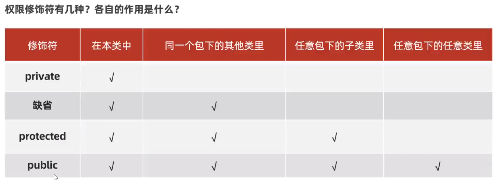

## 面向对象高级-1

这部分涉及：static关键字、设计模式：单例、继承

> static解决数据被所有对象共享的问题；单例是让类对外只能产生一个对象的解决方案；实体类代码复用的问题由继承来解决

### Static 关键字

#### 修饰成员变量

静态，可修饰成员变量、成员方法。

成员变量按照有无static修饰可分为两种：

* 类变量：属于类，只在计算机中存储一份，会被类的全部对象共享
* 实例变量（对象的变量）：属于每个对象

类变量的访问：

```java
//推荐
ClassName.Variable
//也可以但不推荐
对象.类变量
```


课程视频中讲解了一个应用场景还挺有意思的：系统启动后要求用户类能够自动计数创建了多少个用户对象。

```java
public class User{
    public static int number;
    
    public User(){
        User.number++;
    }
}
```

之前没有想过能直接修改构造器来实现方法，很有意思。

#### 修饰成员方法

同样类方法和实例方法

类方法推荐：`类名.类方法`来访问

类方法最常见的应用场景是做工具类，给开发人员共同使用的；工具类中方法都是类方法，每个方法完成一个功能；这样做提高了代码复用，调用方便，提高了开发效率。

如果用实例方法，需要创建对象会占用内存。

**工具类没有创建对象的需求，建议将工具类的构造器进行私有**，也即用private来修饰构造器。

**注意事项**：

1. 类方法中可以直接访问类的成员，不可以直接访问实例成员
2. 实例方法中既可以直接访问类成员，也可以访问实例成员
3. 实例方法中可以出现`this`关键字，类方法中不可以出现关键字

#### 代码块

代码块是类的五大成分之一：成员变量、构造器、方法、代码块、内部类。

**定义**：代码块是用`{}`括起来的一段代码。在Java类中，根据位置和声明方式不同，分为普通代码块，构造代码块，静态代码块和同步代码块。

* **普通代码块**：定义在方法中的代码块，主要用于限制变量的作用域。例如：

```java
public class CodeBlockExample {
    public void testMethod() {
        {
            int localVar = 10;
            System.out.println("普通代码块中的变量: " + localVar);
        }
        // 这里不能访问localVar，因为它超出了作用域
    }
}
```

- **构造代码块**：定义在类中但在方法体外的代码块，每次创建对象时都会执行，优先于构造方法执行，用于初始化一些通用的对象属性。主要用于提取多个构造方法中的共同代码部分，实现代码复用

  例如：

```java
public class Person {
    String name;
    int age;

    {
        age = 18; // 给所有Person对象的age初始值设为18
    }

    public Person(String n) {
        name = n;
    }
}
```

- **静态代码块**：使用`static`修饰的代码块，在类加载时执行，且只执行一次，常用于初始化类变量（完成类的初始化）等操作。例如：

  > 这里如果是简单逻辑如赋值等就可以直接来赋值，但是执行复杂逻辑就需要静态代码块来执行；比如定义了一个类变量，就不能在类中静态代码块之外的地方为它赋值

```java
public class StaticCodeBlockExample {
    static int staticVar;

    static {
        staticVar = 100;
        System.out.println("静态代码块执行，初始化staticVar为 " + staticVar);
    }
}
```

- **同步代码块**：主要用于多线程编程中，通过`synchronized`关键字修饰，确保在同一时刻只有一个线程能够执行该代码块，用于解决多线程访问共享资源时的线程安全问题。例如：

```java
public class SynchronizedCodeBlockExample {
    private static final Object lock = new Object();

    public void synchronizedMethod() {
        synchronized (lock) {
            // 线程安全的代码
        }
    }
}
```

#### 单例设计模式

设计模式：具体问题的最优解法。

单例设计模式：确保一个类只能有一个对象

**写法**：

1. 把类的构造器私有

2. 定义一个类变量，记住一个类的对象

3. 定义一个类方法，返回对象

```java
public class A{
    private static A a = new A();
    private A(){
        
    }
    
    public static A getObject(){
        return a; 
    }
}
```


单例设计模式实现方式很多：比如饿汉式单例、懒汉式单例

### 继承

关键字`extends`使两个类之间建立起父子关系

```java
public class B extends A{
    
}
```

A为父类/基类/超类；B子类/派生类

子类能继承父类的非私有成员（成员变量、成员方法）；子类的对象由子类和父类共同完成

继承可以提高代码复用性



这里protected的任意包的子类的含义是：在其他包的继承了父类的类中可以访问


Java只支持单继承，不支持多继承，但是可以多层继承。多继承指的是一个类直接从多个父类继承属性和行为的能力

> 指的是比如类B继承A，C继承B，D继承C是可以的

方法重写，子类可以重写一个与父类方法名称，参数列表都一样的方法，去覆盖父类的方法；子类复写父类方法时，访问权限必须大于或者等于父类方法的权限。

一个不继承父类的类会默认继承Object类；所有类都是Object的子孙类

子类方法中访问其他成员，依靠就近原则，如果想访问别的可以用`super`和`this`。

子类全部构造器，都会先先调用父类构造器，再执行自己的构造器

在子类构造器中不想使用默认的`super()`无参数方式调用父类构造器，还可以手动使用`super(参数)`调用父类有参数构造器，甚至可以用`this`调用自己类中的其他构造器

> 只能放到构造方法的第一句，否则会报错

## 面向对象进阶二 - 多态

多态是在继承/实现情况下的一种现象，表现为：对象多态、行为多态。

多态：在 Java 中，可以把一个**子类类型的对象**赋值给**父类类型**。

这也导致了，编译器不可能确切的知道 **一个变量到底是存放着自己类型的对象，还是自己子类类型的对象**。

多态前提是有继承/实现关系；存在父类引用指向子类对象；存在方法重写。 

```java
Parant p = new Child();
```

我们对于对象和行为谈多态，Java中的属性即成员变量是不谈多态的

**多态的好处**：

* 定义方法时，使用父类类型的形参，可以接收一切子类对象，拓展性更强更便利

```java
public static void go(People p){
  
}
```


* 在多态形式下，右边的对象是解耦合的，更便于扩展和维护

> 右边对象业务不符合时，可以直接换成新的，后面的方法调用代码不用改，因为都在父类中存在，在子类中重写了，所以是解耦合的

多态下独有的问题就是不能直接调用子类独有的方法，因为编译的时候会看父类，实际运行的时候才在子类中找。

* 解决这个问题需要类型转换，但是必须确保转换后类型是相同的，否则就会报类型转换异常（ClassCastException）的错误

**强制转换前，Java建议使用instanceof关键字**，判断当前对象的真实类型，再进行强转

```java
p instanceof ClassName //p是ClassName实例或者其子类的实例，返回true，否则是false
```

### final关键字与常量

* final可以修饰类、方法、变量
* 修饰类：该类不能被继承
* 修饰方法：称为最终方法，不能被重写
* 修饰变量：该变量只能被赋值一次

注意：

1. final修饰基本类型的变量，变量存储的数据不能被改变；
2. final修饰引用类型的变量，存储的地址不能改，但是地址指向对象的内容是可以改变的。

**常量**：用 `static final`修饰的成员变量。

### 抽象类

用`abstract`修饰的类或者方法。

抽象方法一定只有方法签名没有方法体；

**抽象类中不一定有抽象方法，有抽象方法的类一定是抽象类。**抽象类最主要的特点就是，抽象类**不能创建对象**，仅作为一种特殊的父类，让子类继承并实现；继承后必须 重写抽象类中的全部抽象方法，否则这个类也必须定义为抽象类

> 接口和抽象类看着挺像的，但是抽象类是一个类模板，类的什么它都有；但是接口只能包含常量，不能包含普通成员变量，只能由抽象方法、默认方法和静态方法

设计抽象类，为了更好的支持多态

**常见应用场景：模板方法设计模式**：

解决方法中存在重复代码的问题，部分代码不同。

写法：1. 定义一个抽象类；2. 分别定义模板方法和抽象方法，前者放进复用代码，后者的具体实现交给子类。


**建议使用final修饰模板方法**，使得禁止子类重写模板方法

### 接口

interface

默认变量类型为`public static final`，不用加这个修饰符。

接口也不能创建对象.

优点：弥补类单继承的不足，一个类同时可以实现多个接口；让程序可以面向接口编程，方便业务实现


从JDK8开始，接口新增了三种形式的方法：

1. 默认方法（实例方法），default修饰，默认被加上public修饰；只能使用接口的实现类对象调用
2. 私有方法：必须用private修饰（JDK9开始才支持）
3. 类方法（静态方法）：用static修饰，默认会被加上public修饰，只能用接口名来调用

**一个接口可以同时继承多个接口**：

```java
public interface C extends B, A{
  
}
```

接口除了上面的多继承特点之外，在多实现、继承和实现并存时，有可能出现方法名冲突的问题，需要了解怎么解决

```java
1.一个接口继承多个接口，如果多个接口中存在相同的方法声明，则此时不支持多继承
2.一个类实现多个接口，如果多个接口中存在相同的方法声明，则此时不支持多实现
3.一个类继承了父类，又同时实现了接口，父类中和接口中有同名的默认方法，实现类会有限使用父类的方法
4.一个类实现类多个接口，多个接口中有同名的默认方法，则这个类必须重写该方法。
```

综上所述：一个接口可以继承多个接口，接口同时也可以被类实现。

## 面向对象高级三

### 内部类

> 是类的五大成分之一：成员变量、方法、构造器、内部类、代码块
>
> 一个类定义在另一个类的内部，这个类就是内部类


