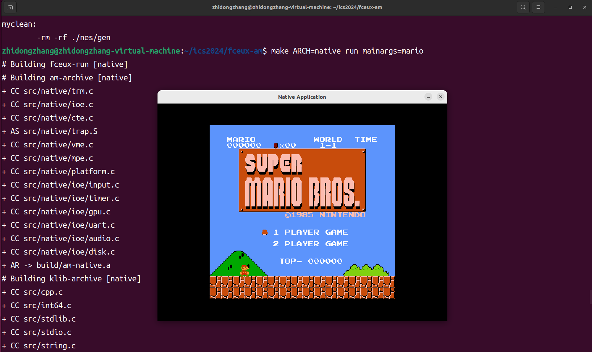

## 实验介绍及有用的链接

实验指南与文档：https://nju-projectn.github.io/ics-pa-gitbook/ics2024/index.html

这门课除了这份很详尽的实验指南之外，其实还有对应的录播课，是南京大学软件学院[王惠妍](https://cocowhy1013.github.io/)老师录制的，具体课程地址为：https://space.bilibili.com/49964811/channel/collectiondetail?sid=3778580

## PA0

## PA1

首先介绍了NEMU全系统模拟器有什么用，用移植的[红白模拟器项目]([NJU-ProjectN/fceux-am](https://github.com/NJU-ProjectN/fceux-am))来引入。jyy的网站上提供了一下游戏的ROM用于测试

``` bash
wget https://box.nju.edu.cn/f/3e56938d9d8140a7bb75/?dl=1
```

实现的效果如下：


## PA2

## PA3

## PA4